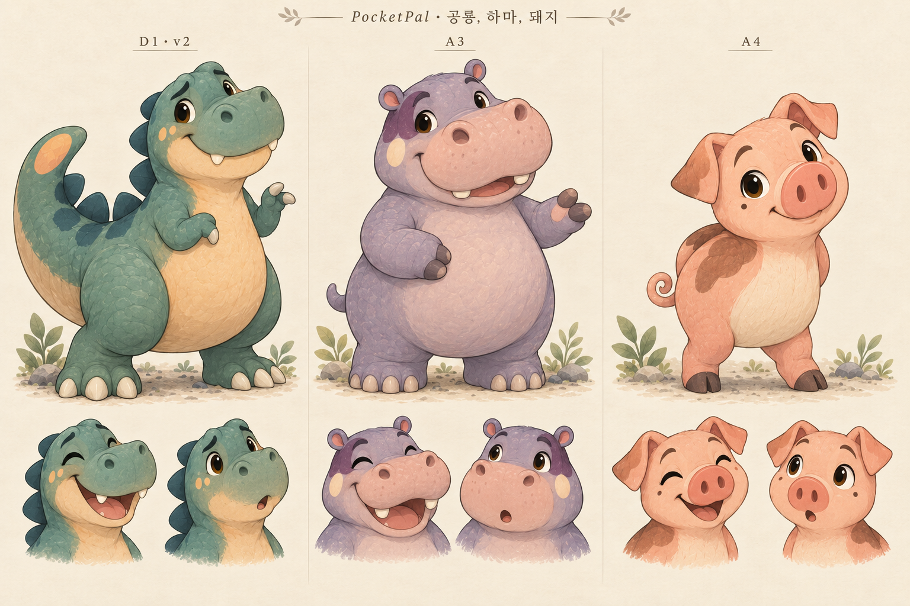

# PocketPal · 오리지널 친구와 Pixel Adventure 컬렉션

**[34종 비교 화면](Character_Catalog.html)** · **[오리지널 4종 동작 미리보기](characters/originals/animations/README.md)**

2026-09-08 / 0.4: 모험가 H1·순둥 티라노 D1·하마 A3·돼지 A4에 대기·걷기·대화·수면 동작 초안을 추가했습니다. 캐릭터당 24프레임이며 고정 96×96px 프레임으로 재생합니다. 기존 오리지널 6종의 정지 도트 시안과 Pixel Frog 24종도 같은 비교 화면에서 볼 수 있습니다.

**흰 배경의 애니메이션 초안**입니다. 프레임 일관성·걷기 루프 정제, 투명 배경, 선물 착용, 실제 대화 연결은 후속 작업입니다. 원화 4장과 정지 도트 보드 3장도 그대로 보관합니다.



- [모든 원화와 캐릭터 목록](characters/README.md)
- [캐릭터 제작 방향과 현재 구현 범위](characters/ART_DIRECTION.md)
- [작가 원본과 출처](characters/pixel-frog/README.md)
- [프로그램용 34종 목록](characters/catalog.json)

## 맥북에서 실행하기 · Pixel Edition 0.3

2026-09-08 Pixel Edition 0.3: `Character_Preview.html`을 열면 설치 없이 새 픽셀 캐릭터를 볼 수 있습니다. 대화·기억·선물 저장은 `Start_PocketPal.command`, 실행 안내는 `START_HERE.html`, 변경·검증 내용은 `docs/PIXEL_CHARACTER_0.3.md`입니다.

- [맥북 재시작 계획](docs/MAC_RESTART_PLAN_2026-09-08.md)
- [검증 결과](docs/VALIDATION_2026-09-08.md)
- 소스: `prototype/mac-lab/`, `tools/mac_server.py`
- 검사: `python3 -m unittest discover -s tests -p 'test_mac_lab.py' -v`

아래는 이전 P1.4 기록입니다. 최종 캐릭터 승인 상태나 현재 개발 방향을 나타내지 않습니다. **3D 선물·AR·전후 카메라 목표를 유지**하며 Mac Lab에서는 기억·교감·2D 착용을 먼저 검증합니다.

---

# PocketPal

**아이와 대화하고, 기억하고, 먼저 말을 걸며 함께 성장하는 휴대형 AI 친구**

현재 목표는 판매용 제품이 아니라 두 자녀가 실제로 사용할 수 있는 완성 시제품 2대를 만드는 것입니다.

## 현재 단계

- P0 제품 사양: 대부분 완료
- P1 브라우저 소프트웨어 시제품: **P1.4 진행 중**
- P2 1:1 외형 목업: 준비 중
- 고가 부품·맞춤 배터리·전용 PCB: 아직 구매하지 않음

## 확정 외형

- 104 × 62 × 12.0 mm
- 최대 두께 12.5 mm
- 목표 무게 120 g 이하
- 약 2.8인치 세로형 IPS
- 외경 약 40 mm 평면 클릭휠
- 중앙 버튼 약 15 mm
- 전·후면 카메라 모두 탑재
- 전면 카메라는 상단 베젤 안에 숨김
- USB-C 하단 중앙
- 마이크 2개, 스피커 1개, 진동, Wi-Fi, Bluetooth

## P1.4 핵심 방향

PocketPal 캐릭터는 자동 생성 3D 대신 **하얀 중성 기본 바디 + 고품질 2D 애니메이션 + 꾸미기 파츠 + 소울 상태**로 진행합니다.

기본 바디는 동일한 친구로 유지하고 아이가 다음 항목을 꾸밉니다.

- 눈과 입
- 모자와 머리 장식
- 옷과 무늬
- 배지
- 아이가 그린 그림 선물

캐릭터의 정체성은 외형뿐 아니라 이름, 기억, 말투, 성격, 친밀도와 자발 행동으로 형성합니다.

## P1.4 웹 시제품

현재 구현:

- 모바일 스크롤과 충돌하지 않는 가상 클릭휠
- 승인된 하얀 중성 기본 바디
- 머리·목·몸통·팔·다리 분리 애니메이션 리그
- 지속적인 호흡과 미세한 자세 움직임
- 불규칙한 눈 깜빡임
- 포인터와 무작위 시선 추적
- 말할 때 입 움직임
- 손 흔들기, 점프, 기쁨, 궁금함, 졸림, 쓰다듬기 동작
- 점눈, 동그란눈, 졸린눈
- 미소, 작은입, 고양이입
- 비니, 왕관, 새싹
- 민트, 분홍, 파랑, 노랑 옷
- 별과 하트 배지
- 이름 저장
- 다정함, 호기심, 명랑함, 차분함 성격
- 따뜻함, 장난스러움, 차분함 말투
- 아이 이름과 좋아하는 이야기 저장
- 기억과 시간에 따른 자발 발화
- 그림을 head, face, body, badge, hand 슬롯에 선물하는 시험
- 전·후면 카메라 전환
- 로컬 기억 저장

## 소울 엔진 v0.1

소울 엔진은 다음 상태를 로컬에 유지합니다.

```text
기분
에너지
호기심
친밀도
최근 상호작용
기본 성격
말투
아이를 부르는 이름
좋아하는 주제
저장된 기억
```

일정 시간 동안 상호작용이 없으면 시간, 기억, 성격을 바탕으로 먼저 말을 겁니다. 캐릭터를 터치하거나 쓰다듬으면 친밀도가 올라가고 표정과 동작이 함께 변합니다.

## 저장소 구조

```text
PocketPal/
├── README.md
├── index.html
├── docs/
│   ├── PocketPal_Master_Spec_v0.1.md
│   ├── PROJECT_STATUS_2026-08-02.md
│   ├── POCKETPAL_BASE_CHARACTER_V0.1.md
│   └── 3D 연구 문서
├── prototype/
│   └── p1-web/
│       ├── index.html
│       ├── app.js
│       ├── styles.css
│       ├── mobile.css
│       ├── soul-character.css
│       ├── base-body-v01.css
│       ├── soul-character.js
│       ├── character-studio.js
│       └── 3D 연구 파일
└── tools/
    └── 3D 연구 브리지
```

## 3D 연구 코드

기존 img2threejs, GLB 뷰어와 3D 작업 규격은 연구 자료로 저장소에 남겨 둡니다. P1.4 메인 화면에서는 불러오지 않으며, 캐릭터 품질과 사용성이 검증된 뒤 AR 전용 선택 기능으로만 재검토합니다.

## 개발 원칙

- 기존 PC·스마트폰·웹캠·마이크·스피커로 먼저 시험
- 국내 재고와 빠른 배송 우선
- 실제 치수와 데이터시트로 검증
- 확정 / 잠정 / 검증 필요를 구분
- 콘셉트 이미지를 제작용 CAD로 단정하지 않음
- 캐릭터 외형보다 대화, 기억, 자발 행동과 교감을 우선 검증

## 주요 문서

- [마스터 사양서](docs/PocketPal_Master_Spec_v0.1.md)
- [2026-08-02 진행 기록](docs/PROJECT_STATUS_2026-08-02.md)
- [PocketPal 기본 캐릭터 v0.1](docs/POCKETPAL_BASE_CHARACTER_V0.1.md)

---

> PocketPal은 기능을 많이 넣는 기기가 아니라, 아이가 오래 곁에 두고 싶은 AI 친구를 만드는 프로젝트입니다.
