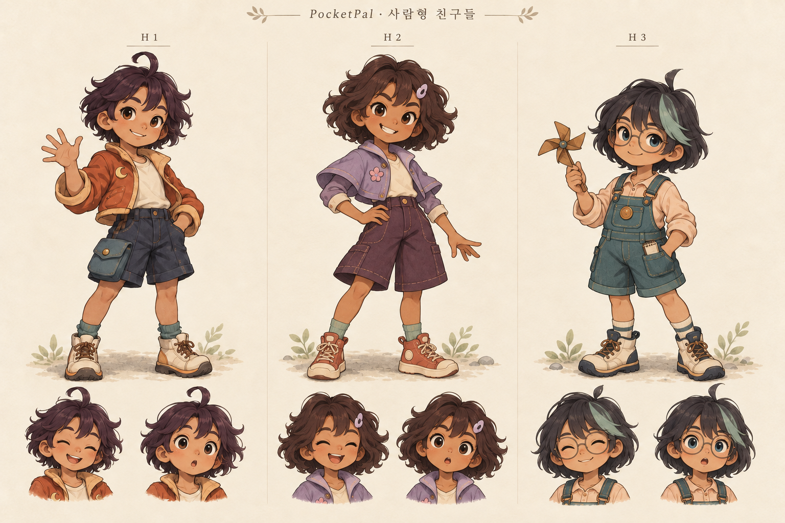
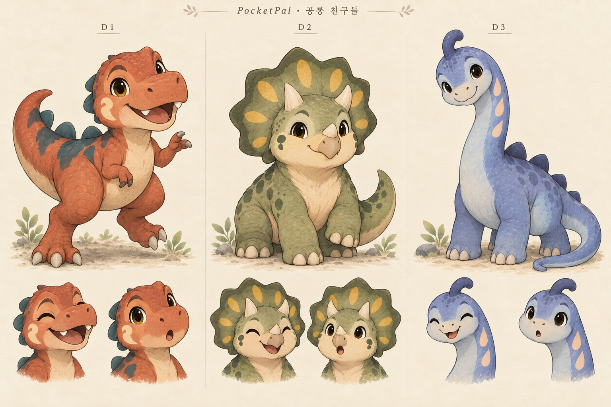
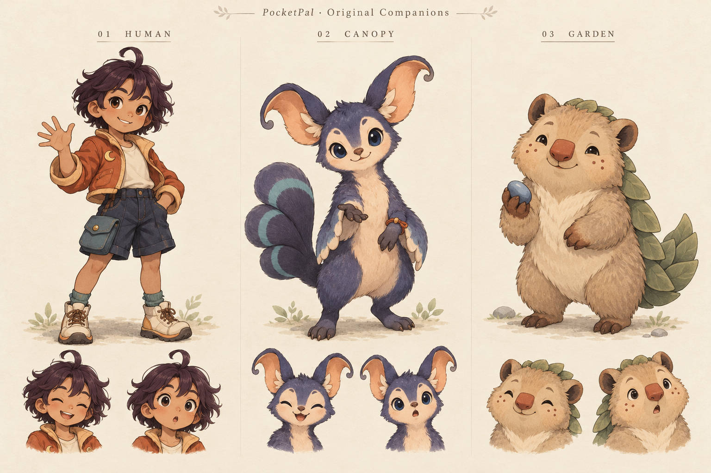

# PocketPal 캐릭터 모음

**PocketPal 오리지널 10종 + Pixel Frog의 Pixel Adventure 캐릭터 24종, 총 34종을 보관합니다.**

사람형·공룡형·동물형을 함께 발전시킵니다. 최신 공룡 방향은 덩치가 커도 순하고 조금 어설픈 친구이며, 하마와 돼지도 추가했습니다. 캐릭터 이름은 아직 임시 설명명입니다.

| 자료 | 포함 내용 | 현재 상태 |
|---|---|---|
| [오리지널 원화](originals/) | 사람형 3종, 공룡형 3종, 동물형 4종 / 원화 보드 4장 | 외형·표정 시안 보관 |
| [오리지널 도트 시안](originals/pixel/README.md) | 동일한 10종의 도트 버전 / 보드 3장 | 10종 정지 시안 + 별도 4종 동작 초안 |
| [Pixel Frog 원본](pixel-frog/) | Pixel Adventure 1의 주인공 4종 + Pixel Adventure 2의 20종 | 작가 원본 PNG 127개 보관 |
| [34종 동작·시안 미리보기](../Character_Catalog.html) | 오리지널 4종 동작 16개 + 정지 6종 + 원본 동작·포즈 66개 | 파일을 내려받아 브라우저에서 실행 |
| [전체 캐릭터 목록](catalog.json) | 34종의 ID·분류·원본 경로·제작 상태·출처 | 프로그램에서 읽을 수 있는 JSON |

오리지널 10종 중 H1·D1·A3·A4에는 [4가지 동작 초안](originals/animations/README.md)을 추가했습니다. 나머지 6종은 정지 시안입니다. 현재 Mac Lab 대화·기억·선물 화면에서 선택할 수 있는 캐릭터는 Pink Man과 Ninja Frog 2종입니다. 34종 미리보기는 개발용 컬렉션이며, 모든 캐릭터의 대화·수면·착용 애니메이션이 구현된 상태는 아닙니다.

## 도트 버전도 포함합니다

**오리지널 10종 모두 일반 원화와 도트 시안을 보관했습니다.** 아래 공룡을 포함해 [사람형 3종·공룡형 3종·동물형 4종의 도트 파일](originals/pixel/README.md)을 볼 수 있습니다. 이 보드 자체는 정지 외형 시안입니다. 별도 [4종의 재생용 아틀라스](originals/animations/README.md)를 추가했으며, 투명 배경 최종 자산은 제작 전입니다.

## 최신 공룡·하마·돼지

| ID | 캐릭터 | 방향 |
|---|---|---|
| D1 v2 | 순둥 티라노 | 큰 배와 작은 팔, 수줍게 용기를 내는 표정, 두꺼운 꼬리 |
| A3 | 하마 친구 | 넓은 주둥이, 묵직한 체형, 느긋하고 푸근한 성격 |
| A4 | 돼지 친구 | 접힌 귀, 동그란 코, 말린 꼬리, 호기심 많은 성격 |

D1의 초기 주황색 시안도 아래에 보관했습니다. v1과 v2는 같은 캐릭터의 디자인 후보이며 별도 종으로 중복 집계하지 않습니다.

## 사람형 3종

| ID | 캐릭터 | 방향 |
|---|---|---|
| H1 | 모험가 친구 | 주황 재킷, 말린 앞머리, 명랑하고 호기심 많은 친구 |
| H2 | 활발한 친구 | 보라색 옷, 짧은 곱슬머리, 재치 있고 먼저 다가오는 친구 |
| H3 | 발명가 친구 | 안경, 청록 멜빵바지, 다정하고 관찰을 좋아하는 친구 |

## 공룡형 초기 시안

| ID | 캐릭터 | 방향 |
|---|---|---|
| D1 v1 | 티라노 초기안 | 주황색의 활발한 시안. 최신 방향은 위의 v2 |
| D2 | 트리케라 친구 | 넓은 프릴과 세 뿔, 든든하고 고집이 조금 있는 친구 |
| D3 | 긴목 공룡 친구 | 부드럽게 굽은 목, 이야기를 들어 주는 차분한 친구 |

## 처음 만든 동물형 2종

| ID | 캐릭터 | 방향 |
|---|---|---|
| A1 | 숲속 귀 친구 | 말린 긴 귀와 부채꼴 꼬리, 날렵하고 궁금한 것이 많은 친구 |
| A2 | 정원 친구 | 잎 모양 등판, 조용하고 작은 선물을 소중히 여기는 친구 |

이 보드의 H1은 사람형 보드에도 등장하는 동일 캐릭터입니다.

## Pixel Frog 캐릭터 전체

**아래 원화와 원본 애니메이션의 작가는 Pixel Frog입니다.** PocketPal 오리지널 시안과 출처를 구별해 보관합니다.

| Pixel Adventure 1 · 4종 | Pixel Adventure 2 · 20종 |
|---|---|
| Pink Man, Ninja Frog, Virtual Guy, Mask Dude | Bunny, Duck, AngryPig, Chicken, Ghost, Mushroom, BlueBird, Bee, Chameleon, FatBird, Radish, Plant, Snail, Turtle, Slime, Trunk, Bat, Rino, Rocks, Skull |

- [원본 파일과 출처](pixel-frog/README.md): 대기·걷기·달리기뿐 아니라 배포본에 들어 있던 나머지 캐릭터 동작과 공용 등장·퇴장 파일도 포함합니다.
- [오리지널과 함께 보는 34종 비교 화면](../Character_Catalog.html): 다운로드한 HTML을 Safari나 Chrome에서 열면 인터넷 없이 볼 수 있습니다.
- [미리보기 소스와 설명](../prototype/mac-lab/catalog/README.md): 66개 비전투 동작·포즈를 사용합니다. Rocks의 크기 3개는 한 캐릭터의 변형으로 집계합니다.

## 제작 기록

- [외형 방향과 다음 제작 단계](ART_DIRECTION.md)
- [34종 캐릭터 목록과 원화 해시](catalog.json)
- [Pixel Frog 원본 파일 해시](pixel-frog/provenance.json)

이미지는 생성·다운로드된 원본 바이트 그대로 보관합니다. 원화 보드는 배경이 포함된 콘셉트 이미지이며, 투명 배경 스프라이트나 부위별 애니메이션 리그가 아닙니다.
