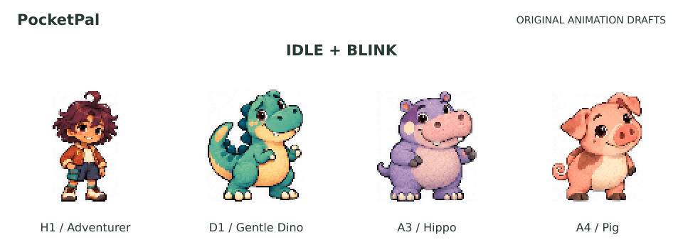

# PocketPal 오리지널 동작 초안 · 0.4

모험가 H1, 순둥 티라노 D1 v2, 하마 A3, 돼지 A4의 **대기·걷기·대화·수면**을 비교하는 첫 애니메이션 묶음입니다. 기존 외형 시안을 참조해 실제로 다른 포즈를 생성하고, 고정 프레임에 정렬했습니다. 4종 × 4동작 × 6프레임으로 총 96프레임입니다.

- [34종 비교 화면](../../../Character_Catalog.html): 내려받아 Safari 또는 Chrome에서 열면 됩니다. 인터넷·Python·Node 설치 없이 동작합니다.
- [움직이는 4종 미리보기](PocketPal_Original_Animation_Preview.gif)
- [사용한 원본과 경계](sources.json)
- [전체 생성 프롬프트](prompts.json)



| ID | 캐릭터 | 현재 상태 |
|---|---|---|
| H1 | 모험가 친구 | 동작 초안 4개, 96×96px 재생 프레임 |
| D1 | 순둥 티라노 | v2 외형 기반 동작 초안 4개, 96×96px 재생 프레임 |
| A3 | 하마 친구 | 동작 초안 4개, 96×96px 재생 프레임 |
| A4 | 돼지 친구 | 동작 초안 4개, 96×96px 재생 프레임 |
| H2·H3·D2·D3·A1·A2 | 나머지 오리지널 6종 | 기존 정지 도트 시안으로 비교 화면에 포함 |

## 재생 자산

각 ID 폴더의 `atlas-v1.png`는 576×384px, 가로 6열·세로 4행입니다. 셀 크기는 96×96px이며 행은 대기 / 걷기 / 대화 / 수면 순서입니다. `idle.png`, `walk.png`, `talk.png`, `sleep.png`는 동작별 576×96px 스트립입니다. `manifest.json`은 프레임 좌표, 속도, 파일 해시, 생성 원본 좌표와 보정 내용을 담습니다.

- 대기 4 FPS, 걷기 8 FPS, 대화 6 FPS, 수면 3 FPS.
- 각 캐릭터는 전체 동작에서 같은 배율을 유지합니다. 발 위치를 89px 기준에 맞춰 프레임마다 바닥이 흔들리는 문제를 줄였습니다.
- 확대는 nearest-neighbour 방식입니다. 작은 화면에서 읽을 수 있도록 고정 96px 격자로 옮긴 재생 초안이며 수작업으로 정제한 제한 팔레트 픽셀 아트와는 제작 방식이 다릅니다.
- 이미지 제작: 내장 ImageGen. 후처리: 원본 포즈 자르기, 크기·발 위치 정렬, 흰 배경 프레임 포장. 포즈를 코드로 새로 그리거나 정지 한 장을 흔드는 방식으로 대체하지 않았습니다.

## 검증 필요

**외형과 동작 모두 사용자 최종 승인 전입니다.** 프레임마다 얼굴·크기·시선·팔다리의 세부 차이가 있고, 걷기의 좌우 발 교대와 루프 이음새는 더 다듬어야 합니다. 눈 깜빡임이 길게 보이는 부분도 이후 타이밍 보정 대상입니다.

생성 결과의 배경은 흰색 RGB입니다. 투명 배경 PNG로 표시하지 않으며, 다른 배경에 자연스럽게 겹쳐 쓰는 게임용 최종 자산은 아닙니다. H1과 D1의 첫 출력에 들어간 체크무늬는 ImageGen의 배경 수정으로 흰색으로 바꿨습니다. 최종 사용한 보정 이미지와 프롬프트를 함께 보관합니다.

이번 비교 화면의 대화는 입 모양 프레임 재생입니다. 음성에 맞춘 입 모양 동기화, 실제 AI 답변 연결, 인사·기쁨·수줍음 전용 동작, 뒤·옆 모습, 선물 부착점과 옷 레이어는 아직 없습니다. Mac Lab의 실제 대화·기억·선물 화면은 기존 Pink Man/Ninja Frog 2종을 사용합니다.

## 다시 만들기

완성된 HTML을 여는 데에는 설치가 필요 없습니다. 제작자가 원본에서 다시 추출할 때만 Node와 `sharp`가 필요합니다.

```sh
npm install --prefix tools/asset-pipeline
node tools/asset-pipeline/package-originals.mjs
python3 tools/build_character_catalog.py
node tools/asset-pipeline/build-preview.mjs
```

GIF는 같은 아틀라스 프레임을 `sharp`로 재생 패키징합니다. 원화 및 Pixel Frog 파일은 기존 자산 그대로 유지하며, 이 파이프라인은 오리지널의 재생용 파생 파일만 만듭니다.

다음 제작에서는 이 4종의 걷기와 표정 연결을 정제하고, 투명 배경과 부착점을 만든 뒤 Mac Lab에 연결합니다. 나머지 6종에도 동일한 자산 형식을 적용할 수 있습니다. 기기 외형, 전후 카메라, 클릭휠, NAS 기억 구조, 3D 선물·AR 목표는 기존 사양을 따릅니다.
