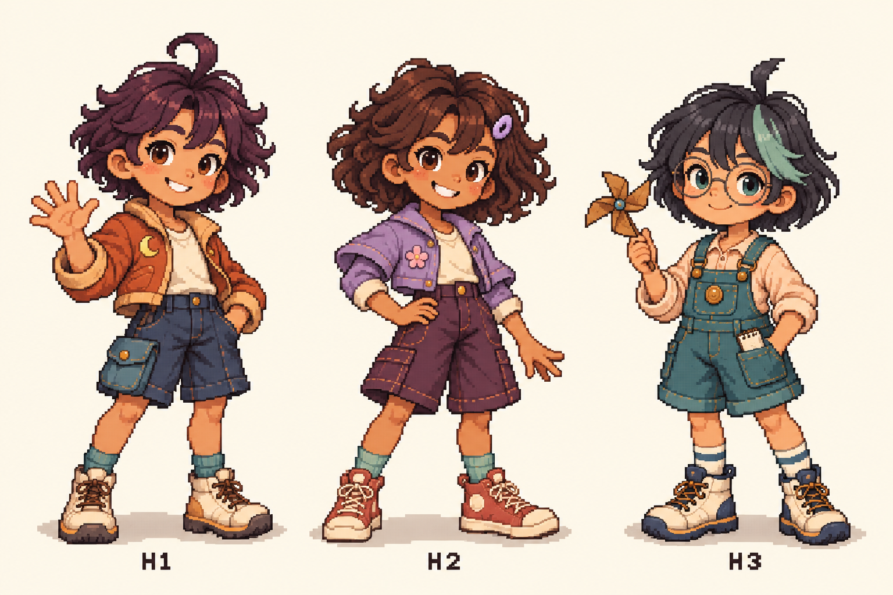
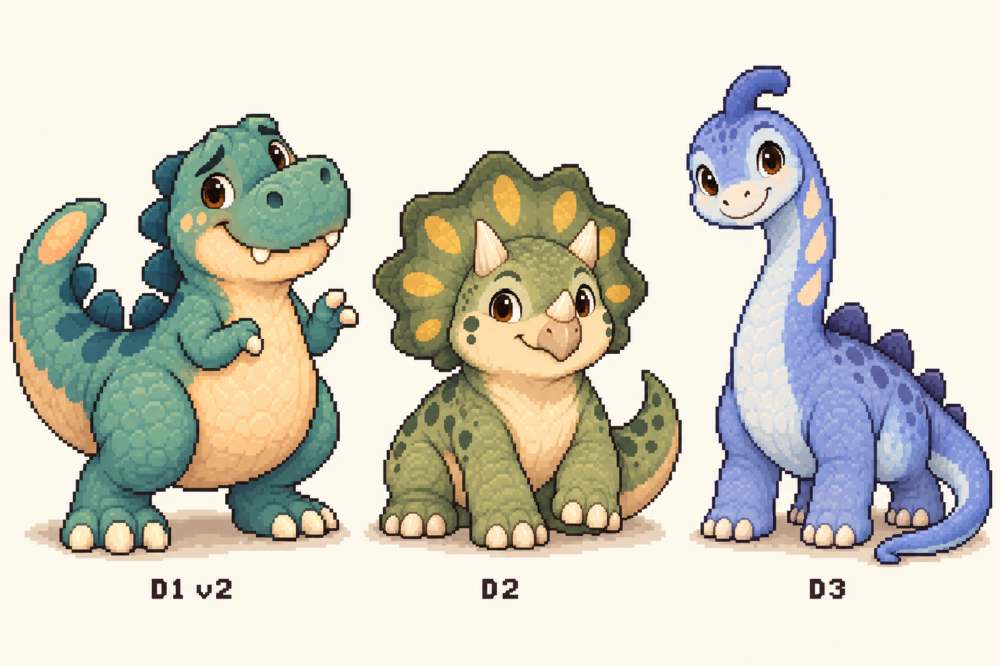
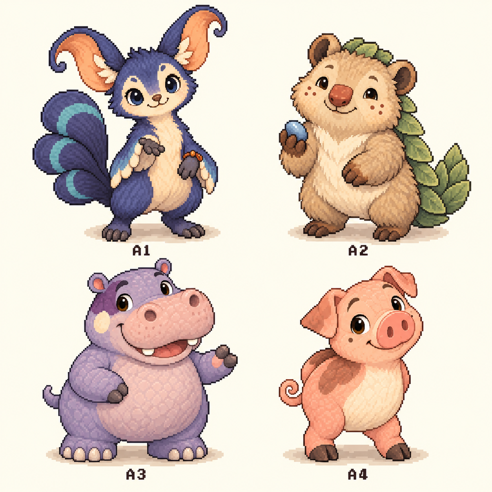

# PocketPal 오리지널 · 도트 시안 10종

기존 사람형·공룡형·동물형 원화를 참조해 ImageGen으로 새로 만든 **정지 도트 스타일 시안**입니다. 캐릭터의 얼굴, 체형, 옷, 무늬와 색을 이어 갔습니다.

## 사람형 · H1, H2, H3

## 공룡형 · D1 v2, D2, D3

D1은 최신 순둥 티라노 v2를 기준으로 했습니다. D2와 D3는 기존 공룡 원화의 디자인을 이어 갑니다.

## 동물형 · A1, A2, A3, A4

왼쪽 위 A1, 오른쪽 위 A2, 왼쪽 아래 A3 하마, 오른쪽 아래 A4 돼지입니다.

## 후속 동작 제작 · 0.4

H1·D1·A3·A4의 [대기·걷기·대화·수면 동작 초안](../animations/README.md)을 추가했습니다. 아래 항목은 이 폴더의 정지 원본 보드에 대한 설명입니다.

## 정지 원본 보드의 상태

- 배경과 캐릭터 ID가 포함된 비교용 PNG 3장입니다. 캐릭터마다 별도의 애니메이션 프레임이 들어 있는 파일은 아닙니다.
- 이미지 생성 결과를 그대로 보관했으며, 고정 격자·제한 팔레트·투명 배경을 갖춘 게임용 스프라이트 아틀라스로 가공한 상태는 아닙니다.
- 별도 동작 묶음은 4종·96프레임입니다. 세부 일관성 보정, 투명 배경, 선물 착용 위치와 Mac Lab 연결은 다음 제작 단계입니다.
- 34종 비교 화면에서 오리지널 4종 동작, 6종 정지 시안, Pixel Frog 24종 원본을 함께 볼 수 있습니다. Mac Lab 대화 화면의 캐릭터 선택은 기존 2종입니다.

이 도트 시안은 기존 오리지널 10종의 표현 방식입니다. 새로운 10종으로 중복 집계하지 않으므로 전체 캐릭터 수는 34종입니다. 각 파일의 해시와 원화 대응 관계는 [전체 캐릭터 목록](../../catalog.json)의 `pixel_concept_boards`와 `pixel_design`에 기록했습니다.

[원화와 전체 캐릭터 보기](../../README.md)
